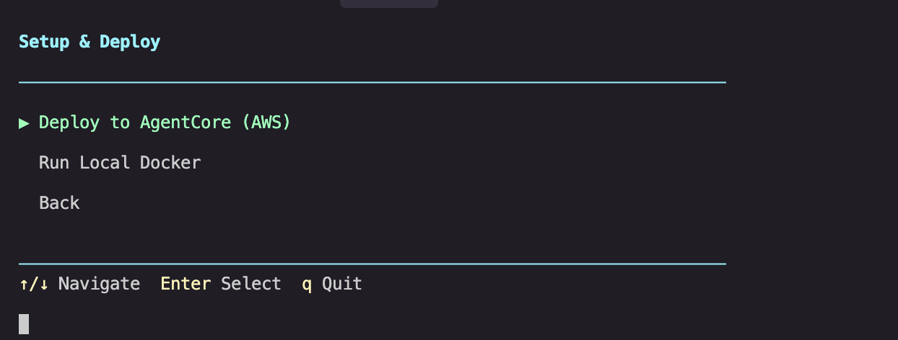
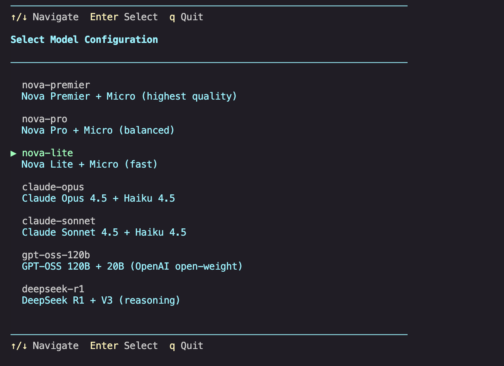
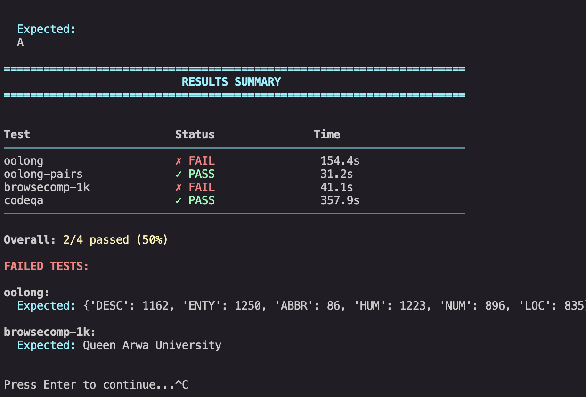
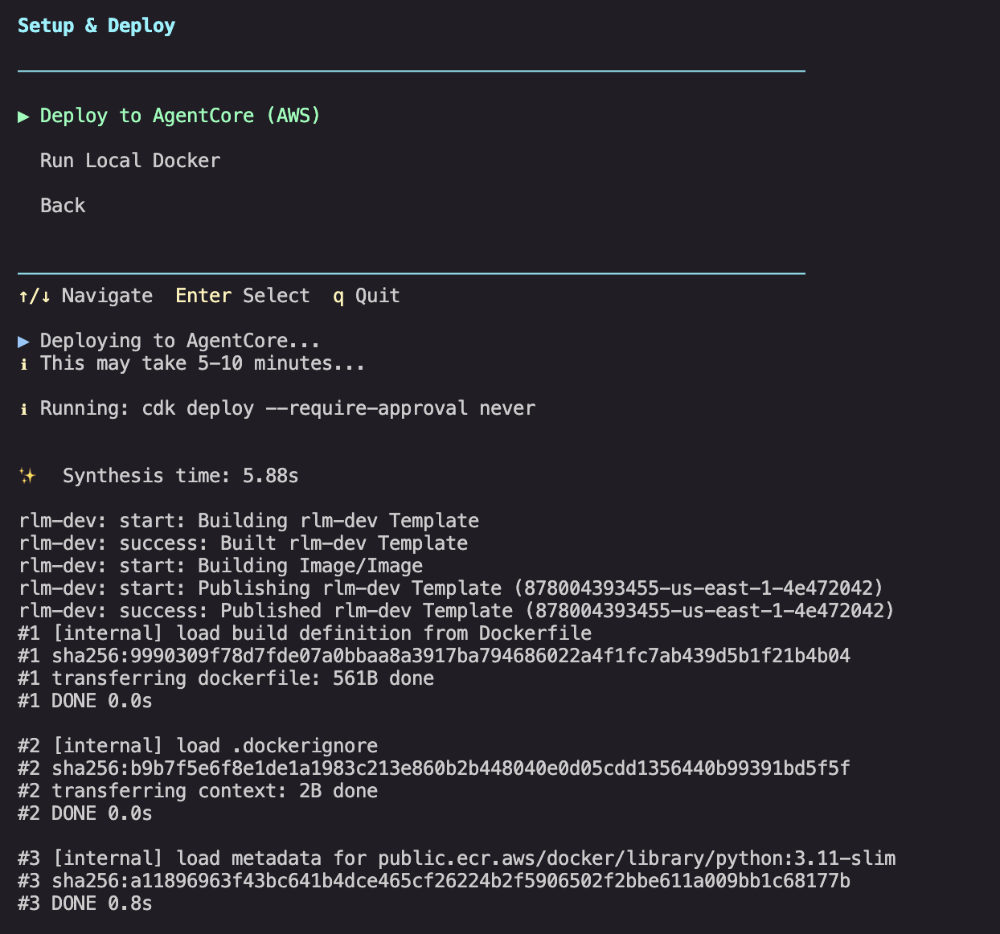

# RLMWithStrands
Implementing Recursive Language Models (MIT paper) with Strands Agents and Amazon Bedrock AgentCore

## Overview

This project implements **Recursive Language Models (RLMs)** from the MIT CSAIL paper "Recursive Language Models" (arXiv:2512.24601). RLMs enable LLMs to process arbitrarily long contexts (10M+ tokens) by treating prompts as external environment variables rather than direct neural network inputs.

**Key Innovation**: Long contexts are loaded into a Python REPL environment where the LLM writes code to inspect, chunk, and recursively process the data.

## Quick Start

### Prerequisites
- Python 3.10+
- Docker (for local testing)
- AWS Account with Bedrock access
- AWS CLI configured

### Setup
```bash
# Clone and activate environment
cd RLMWithStrands
source .venv/bin/activate

# Install dependencies (already installed)
pip install -r app/requirements.txt -r infra/requirements.txt
```

### Deploy to AWS
```bash
cd infra

# Decompress datasets (required before deployment)
gunzip assets/datasets/*.gz

# Deploy
cdk deploy

# Outputs:
# - RuntimeArn: arn:aws:bedrock-agentcore:...
# - ResultsBucketName: rlm-results-dev
# - LogGroupName: /aws/bedrock-agentcore/runtimes/rlm-dev
```

**Note**: Datasets are stored compressed in the repository (47MB). The `gunzip` command decompresses them (216MB) before CDK uploads to S3.

### Run Benchmarks
```bash
python runexperiments
```

The interactive CLI provides a menu-driven interface for running experiments:

<table>
<tr>
<td width="50%">


**Step 1: Main Menu**
Navigate with arrow keys

</td>
<td width="50%">


**Step 2: Select Model**
Choose root and sub-model

</td>
</tr>
</table>

## Architecture


*RLM implementation using Strands Agents and Amazon Bedrock AgentCore*

### RLM Agent (`app/src/rlm_agent.py`)
- **Minimal System Prompt**: Following paper's approach - example-driven, not prescriptive
- **Python REPL**: Context loaded as variable, model writes code to process
- **Recursive Sub-calls**: `llm_query()` function for chunking and decomposition
- **Max 50 sub-calls**: Prevents infinite loops

### Benchmark Agent (`app/src/benchmark_agent.py`)
- **Benchmark Suite**: oolong, oolong-pairs, browsecomp-1k, codeqa
- **Async by Default**: Long-running tasks don't timeout
- **S3 Storage**: Results saved to `s3://rlm-results-dev/results/{experiment}/{session-id}/{timestamp}.json`
- **Real Datasets**: TREC, BrowseComp+, LongBench CodeQA loaded from S3 (deployed from `infra/assets/datasets/`)

### Infrastructure (`infra/`)
- **AgentCore Runtime**: Serverless, auto-scaling, Graviton ARM64
- **S3 Bucket**: Auto-delete on destroy (dev), versioned, encrypted
- **Dataset Deployment**: TREC, BrowseComp+, CodeQA uploaded to S3 at deploy time
- **IAM Permissions**: Bedrock model access + S3 read/write
- **CloudWatch Logs**: `/aws/bedrock-agentcore/runtimes/rlm-dev`

## Experiments

| Experiment | Context Source | Task Focus |
|------------|----------------|------------|
| oolong | Full TREC coarse dataset (5,452 entries) | Count label frequencies across ABBR/ENTY/DESC/HUM/LOC/NUM. |
| oolong-pairs | TREC coarse dataset | List HUM/LOC question ID pairs that satisfy semantic filters (“city”/“capital”). |
| browsecomp-1k | Tevatron BrowseComp+ corpus (streamed 1K docs) | Answer BrowseComp+ research query with thousands of distractor tokens. |
| codeqa | LongBench-v2 (Code Repository Understanding split) | Multi-choice reasoning over real code repositories. |

**Datasets**:
- TREC coarse files plus curated BrowseComp+/LongBench CodeQA slices (~216MB total) are stored in `infra/assets/datasets/`
- The CDK stack uploads them to the benchmark S3 bucket under `datasets/`
- The runtime downloads them on demand

**Note**: Dataset files are compressed in the repository (.gz format, 47MB). Run `gunzip infra/assets/datasets/*.gz` before deployment.

## Models Supported

- Amazon Nova (Premier, Pro, Lite, Micro)
- Claude 4 (Opus 4.5, Sonnet 4.5)
- DeepSeek R1

Root models use Nova Micro or Claude Haiku for sub-calls.

## Async Processing

**Default Mode**: All experiments run async
- Immediate response with task_id and session_id
- Poll for results (no timeout issues - 15min idle timeout only when NOT processing)
- Results stored in S3 with full metadata


*Experiments running with real-time progress*

<table>
<tr>
<td width="50%">


**Detailed Results**
Shows validation reasons and output

</td>
<td width="50%">


**Summary Table**
Pass/fail status for all experiments

</td>
</tr>
</table>

## Local Testing

```bash
cd app

# Build and run Docker
docker build --platform linux/arm64 -t rlm-test .
docker run -d -p 8080:8080 \
  -v ~/.aws:/home/agentcore/.aws:ro \
  -v $(pwd)/../infra/assets/datasets:/tmp/rlm_datasets:ro \
  -e AWS_DEFAULT_REGION=us-east-1 \
  -e DATASET_CACHE_DIR=/tmp/rlm_datasets \
  rlm-test

# Test invocation
curl -X POST http://localhost:8080/invocations \
  -H "Content-Type: application/json" \
  -d '{"experiment": "oolong"}'
```

**Note**: The `-v` flag mounts local datasets so you don't need S3 access for testing.

## Local Testing (Without Docker)

For faster iteration without Docker:

```bash
cd local_testing

# Test single experiment
python test_logic.py oolong

# Run all experiments
python run_all.py
```

These scripts test the benchmark logic locally using your AWS credentials for Bedrock access.

## Viewing Results

Results are automatically saved to S3 and visible in CloudWatch logs. Use the AWS CLI or Console to view them:
- **S3**: `s3://rlm-results-dev/results/{experiment}/{session-id}/{timestamp}.json`
- **CloudWatch**: `/aws/bedrock-agentcore/runtimes/rlm-dev`

## Cleanup

Run `cdk destroy` in the `infra/` directory to remove all resources (S3 bucket, AgentCore runtime, IAM roles, CloudWatch logs).

## Project Structure

```
RLMWithStrands/
├── app/
│   ├── src/
│   │   ├── agent.py              # AgentCore entrypoint
│   │   ├── benchmark_agent.py    # Experiment handler (async)
│   │   ├── rlm_agent.py          # RLM with minimal prompt
│   │   ├── datasets.py           # Dataset loaders
│   │   ├── context_builders.py   # Context generation
│   │   └── experiments.py        # Validators
│   ├── Dockerfile                # ARM64 container
│   └── requirements.txt
├── infra/
│   ├── app.py                    # CDK app
│   ├── config.yaml               # Deployment config
│   ├── infra/rlm_stack.py        # Main stack
│   ├── assets/datasets/          # TREC, BrowseComp+, CodeQA
│   └── cdk_constructs/           # Reusable constructs
│       ├── ecr_image.py
│       ├── agentcore_role.py
│       ├── agentcore_runtime.py
│       ├── log_group.py
│       └── results_bucket.py
├── runexperiments/               # Interactive CLI
│   ├── cli.py                    # Menu system
│   ├── runner.py                 # Benchmark orchestration
│   ├── client.py                 # AgentCore/local client
│   ├── config.py                 # Model configs
│   └── deploy.py                 # Deployment automation
├── local_testing/                # Local test scripts
│   ├── test_logic.py             # Test single experiment
│   └── run_all.py                # Run all experiments
├── blog.md                       # Technical blog post
├── VALIDATION_SUMMARY.md         # Validation system docs
└── README.md
```

## Configuration

Deployment config saved to `~/.rlm_config.json` with runtime ARN, S3 bucket, and target (agentcore/local).

## Key Features

- ✅ **Async-first**: No timeout issues for long experiments
- ✅ **S3 persistence**: All results saved with metadata
- ✅ **Real datasets**: TREC, BrowseComp+, CodeQA deployed to S3
- ✅ **Minimal prompt**: Paper-based approach, emergent behavior
- ✅ **Auto-cleanup**: `cdk destroy` removes everything
- ✅ **Interactive CLI**: Arrow key navigation, deployment automation
- ✅ **Multi-model**: Test across Nova, Claude, GPT-OSS, DeepSeek

## Research Paper

**Paper**: Recursive Language Models  
**Authors**: Alex L. Zhang, Tim Kraska, Omar Khattab (MIT CSAIL)  
**arXiv**: 2512.24601  
**Published**: December 2025

See `paper/` directory for PDF.

## License

MIT
